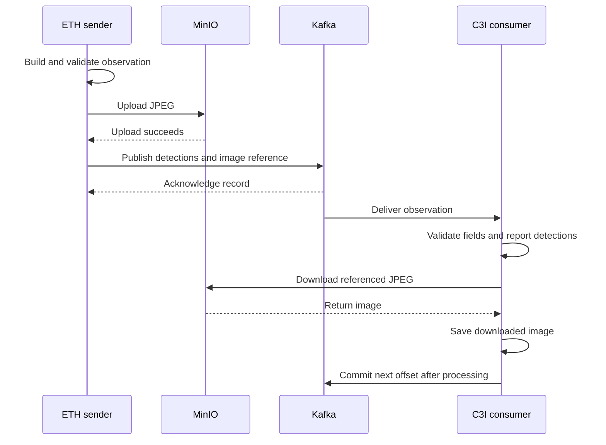

# ForeSight ETH → C3I — User and Integration Guide

This guide explains how to configure, run, test, and extend the integration. Kafka carries environmental readings and observation metadata; MinIO stores the referenced JPEG images; C3I validates and processes the messages and downloads the images.

The supplied readings and detections are synthetic. The project demonstrates the transport and processing workflow; connecting physical sensors or an inference model requires the integration changes described below.

**Project folder:** `ETH/` inside the `foresight` repository

**Guide updated:** 7 October 2026

The repository is organized as `foresight/ETH`, `foresight/CESM`, and `foresight/CNR`. This guide covers ETH; CESM and CNR are reserved for their future integrations. If you received this guide as an email attachment, use the repository URL in that email to obtain the code. Links to files resolve within the repository; the guide itself contains no live server addresses or credentials.

## Contents

1. [Quick start](#1-quick-start)
2. [Installation](#2-installation)
3. [Credentials and configuration](#3-credentials-and-configuration)
4. [Workflow and design](#4-workflow-and-design)
5. [Files and responsibilities](#5-files-and-responsibilities)
6. [Run the application manually](#6-run-the-application-manually)
7. [Testing](#7-testing)
8. [Test reports and output files](#8-test-reports-and-output-files)
9. [Message contract](#9-message-contract)
10. [Connect real ETH data](#10-connect-real-eth-data)
11. [Troubleshooting](#11-troubleshooting)
12. [Verified behavior and limitations](#12-verified-behavior-and-limitations)

## 1. Quick start

If installation and `ETH/.env` are already complete, run these commands in PowerShell starting at the `foresight` repository root. Skip the first command if already inside `ETH/`:

```powershell
Set-Location .\ETH

# 1. Validate the code without contacting Kafka or MinIO.
.\.venv\Scripts\python.exe -m unittest discover -s tests -v

# 2. Check the configured Kafka credentials and topic visibility.
.\.venv\Scripts\python.exe tests\test_kafka_connection.py

# 3. Send and verify three complete samples through Kafka, MinIO, and C3I.
.\.venv\Scripts\python.exe tests\test_workflow.py --count 3
```

The third command performs real writes: it sends **six Kafka messages** (three environmental messages and three observations), uploads **three JPEG objects**, downloads them, compares their contents, and checks committed offsets. It creates its own dedicated test consumer group, so a separate C3I terminal is unnecessary for this test. Other consumers subscribed to these topics can also receive the test messages.

If the configured topics do not exist and the account has permission to create them, add `--create-topics` to the third command. Otherwise, have the topics provisioned before testing. See [Testing](#7-testing) for options and expected results.

## 2. Installation

Use Python **3.11 or newer**. The project has been checked with Python 3.14.4. Kafka and MinIO must be available separately; installing their Python clients does not start the servers.

For a fresh checkout, start at the `foresight` repository root (skip `Set-Location` if already inside `ETH/`):

```powershell
Set-Location .\ETH
py -m venv .venv
.\.venv\Scripts\python.exe -m pip install -r requirements.txt

# Create a local configuration only if one does not already exist.
if (-not (Test-Path -LiteralPath '.env')) {
    Copy-Item -LiteralPath '.env.example' -Destination '.env'
}
```

After this block, your terminal is inside `ETH/`; run subsequent Python commands there. Using the explicit interpreter path avoids the need to activate the virtual environment. On Linux or macOS, enter `ETH/` with `cd ETH`, use `python3 -m venv .venv`, and replace `.\.venv\Scripts\python.exe` in this guide with `.venv/bin/python`.

The pinned runtime dependencies in [requirements.txt](../requirements.txt) are:

| Package | Responsibility |
| --- | --- |
| `kafka-python-ng` | Kafka producer, consumer, and administrative clients; imported as `kafka` |
| `minio` | S3-compatible bucket operations and file transfers |
| `python-dotenv` | Read local environment settings from `.env` |
| `urllib3` | Configure MinIO HTTP connection behavior and timeouts |

The offline tests use Python's built-in `unittest`. Do not install the separate `kafka` or `kafka-python` distributions into this virtual environment alongside `kafka-python-ng`.

For optional server setup instructions, see [Kafka setup](../README.md#start-kafka-without-containers) and [MinIO setup](../README.md#start-minio-without-containers) in the README. Use your existing servers when they are already configured.

## 3. Credentials and configuration

### Where to edit credentials

Edit **`ETH/.env`** (relative to the repository root). This is the active local configuration, shared by the senders, C3I consumer, and default live tests. The file is excluded from version control.

`ETH/.env.example` is a tracked setup template with blank Kafka/MinIO server addresses and credentials. Copy it to `ETH/.env`, then fill in the connection details provided privately in the ETH onboarding email. Editing the template does not update an existing `.env`, and the application does not load it automatically. The template cannot connect as supplied; keep real values out of it.

The template selects **`SASL_PLAINTEXT` with the `PLAIN` mechanism**. Match the protocol, mechanism, and port to the deployment details provided privately. The following hosts are fictitious `.invalid` examples; replace them and the credential placeholders in your local `.env`:

```dotenv
KAFKA_BOOTSTRAP_SERVERS=kafka.example.invalid:29093
KAFKA_SECURITY_PROTOCOL=SASL_PLAINTEXT
KAFKA_SASL_MECHANISM=PLAIN
KAFKA_SASL_USERNAME=REPLACE_WITH_KAFKA_USERNAME
KAFKA_SASL_PASSWORD='REPLACE_WITH_KAFKA_PASSWORD'
KAFKA_SSL_CAFILE=

KAFKA_ENVIRONMENT_TOPIC=foresight.eth.environment
KAFKA_OBSERVATIONS_TOPIC=foresight.eth.observations
KAFKA_CONSUMER_GROUP=foresight-c3i
KAFKA_AUTO_OFFSET_RESET=earliest

MINIO_ENDPOINT=minio.example.invalid:9000
MINIO_ACCESS_KEY=REPLACE_WITH_MINIO_ACCESS_KEY
MINIO_SECRET_KEY='REPLACE_WITH_MINIO_SECRET_KEY'
MINIO_SECURE=false
MINIO_BUCKET=foresight-eth-images
```

Kafka and MinIO use separate accounts. Changing `.env` selects credentials for the clients; it does not create accounts or change passwords on either server. For Kafka PLAIN, a broker JAAS entry named `user_eth_client` corresponds to the client username `eth_client`. See the [broker authentication notes](../README.md#connect-to-your-existing-kafka-server-with-usernamepassword).

`SASL_PLAINTEXT` authenticates without encrypting the connection. To use TLS, the broker must expose a compatible `SASL_SSL` listener; then update the client protocol, address, and CA file as appropriate. MinIO TLS is configured independently with `MINIO_SECURE=true`. Its endpoint must be the **S3 API host and port**, without `http://` or `https://`; do not use its web-console port.

### How configuration is selected

Configuration precedence is:

```text
Existing process environment variables
    → values in the selected .env file
        → defaults defined in config.py
```

`config.py` loads the project `.env` without overwriting existing process variables. Both live test scripts accept `--env-file` to select a different file; the application entry points use the project `.env`. Process environment variables still take precedence when `--env-file` is used.

Dotenv variable interpolation is disabled, so `${...}` inside a password remains literal. Use dotenv quoting for spaces and special characters. Kafka username and password values are preserved without trimming. Credentials are hidden in the settings representation, but client-option dictionaries contain them and must not be logged.

To check whether PowerShell already defines Kafka or MinIO settings without printing their values:

```powershell
Get-ChildItem Env: |
    Where-Object Name -Match '^(KAFKA_|MINIO_)' |
    Select-Object -ExpandProperty Name
```

If a stale username or password override is the cause, remove that override from the current PowerShell session before retrying:

```powershell
Remove-Item Env:KAFKA_SASL_USERNAME -ErrorAction SilentlyContinue
Remove-Item Env:KAFKA_SASL_PASSWORD -ErrorAction SilentlyContinue
```

### Credential change workflow

1. Obtain the Kafka broker address, username/password, MinIO S3 API address, and access/secret keys from the private ETH onboarding email or server administrator. Update the corresponding server accounts first if rotating credentials.
2. Stop the running C3I consumer with `Ctrl+C`.
3. Update the appropriate values in `ETH/.env`. Check the endpoint, protocol, and mechanism along with the credentials. Keep these values out of `.env.example`, documentation, tests, and Git commits.
4. Remove or update any conflicting process environment variables in the terminal used to launch the application.
5. Run `tests\test_kafka_connection.py` to check Kafka authentication and topic access.
6. Run `tests\test_workflow.py --count 1` to verify Kafka publishing, consumption, MinIO upload/download, and offset commits together. This creates real test data.
7. Restart the consumer and launch the senders with the new settings.

Settings are read when a process starts; there is no automatic credential reload. A successful Kafka diagnostic alone does not verify the MinIO credentials or Kafka publishing permissions.

### Configuration reference

This table lists **code defaults**, not the contents of your local `.env` or the example template.

| Variable | Code default | Purpose |
| --- | --- | --- |
| `KAFKA_BOOTSTRAP_SERVERS` | `localhost:9092` | One or more comma-separated broker addresses |
| `KAFKA_SECURITY_PROTOCOL` | `PLAINTEXT` | `PLAINTEXT`, `SSL`, `SASL_PLAINTEXT`, or `SASL_SSL` |
| `KAFKA_SASL_MECHANISM` | `PLAIN` | `PLAIN`, `SCRAM-SHA-256`, or `SCRAM-SHA-512`; match the broker |
| `KAFKA_SASL_USERNAME` | Empty | Client username; required for SASL |
| `KAFKA_SASL_PASSWORD` | Empty | Client password; required for SASL |
| `KAFKA_SSL_CAFILE` | Empty | Optional PEM CA file for TLS; relative paths resolve from the project |
| `KAFKA_ENVIRONMENT_TOPIC` | `foresight.eth.environment` | Topic for environmental readings |
| `KAFKA_OBSERVATIONS_TOPIC` | `foresight.eth.observations` | Topic for observations and image references |
| `KAFKA_CONSUMER_GROUP` | `foresight-c3i` | Normal C3I consumer group and saved offsets |
| `KAFKA_AUTO_OFFSET_RESET` | `earliest` | Where to begin when no valid committed offset exists |
| `KAFKA_SEND_TIMEOUT_SECONDS` | `30` | Kafka metadata, acknowledgement, and flush wait configuration |
| `MINIO_ENDPOINT` | `localhost:9000` | S3 API host and port; no URL scheme |
| `MINIO_ACCESS_KEY` | `minioadmin` | Storage access key; code default is for local development |
| `MINIO_SECRET_KEY` | `minioadmin` | Storage secret key; code default is for local development |
| `MINIO_SECURE` | `false` | Enable HTTPS with `true` |
| `MINIO_BUCKET` | `foresight-eth-images` | Bucket for JPEG objects |
| `MINIO_TIMEOUT_SECONDS` | `15` | Storage socket read timeout |
| `RECEIVED_IMAGES_DIR` | `received_images` | Download directory; relative paths resolve from the project |
| `LOG_LEVEL` | `INFO` | Application logging level; `INFO` displays normal readings and detections |

The two configuration timeout values must be greater than zero and at most 60 seconds. Successive calls and retries can take longer than a single timeout. The live test scripts also provide a separate `--timeout` for the complete test process.

## 4. Workflow and design

### Environmental readings

```text
Build readings → validate JSON fields → publish to Kafka → receive in C3I
    → validate and print readings → commit that record's next offset
```

`send_environment.py` creates one message, validates it, and publishes it to `KAFKA_ENVIRONMENT_TOPIC`. The Kafka key is the `device_id`. The sender waits for broker acknowledgement before reporting its topic, partition, and offset.

### Camera observations and images



The sequence is **validate → upload → publish → consume → download → commit**. Kafka carries the bucket and object key, not the JPEG bytes. The object key is derived from the camera ID, UTC capture date, and frame ID:

```text
<device_id>/<YYYY>/<MM>/<DD>/<frame_id>.jpg
```

If the upload fails, the observation is not published. If publishing fails after a successful upload, the object remains in MinIO. A publication timeout can have an ambiguous outcome, so the application does not automatically delete the uploaded object.

The normal consumer validates each message and downloads each referenced image before committing. A processing failure stops the consumer and leaves the failed record uncommitted. Correct the cause and restart. The workflow test additionally compares downloaded image bytes with the source using SHA-256.

### Why the responsibilities are separated

| Design choice | Reason and effect |
| --- | --- |
| Kafka contains JSON; MinIO contains images | Consumers can inspect readings and detections without carrying large binary payloads in every Kafka record. |
| Shared validation in `messages.py` | Senders, the consumer, and tests use the same message contract. |
| Shared connection settings in `config.py` | Authentication and connection changes apply consistently across clients. |
| Upload before observation publication | A successful upload precedes the image reference becoming visible to consumers. |
| Acknowledged Kafka sends with `acks="all"` | The sender waits for the broker's acknowledgement and can report a concrete record location. Replication still depends on broker configuration. |
| Commit after processing | A failed download or validation does not silently advance the consumer past that record. Processing can repeat after a crash before commit. |
| Dedicated live test consumer group | Tests verify newly published records without advancing the normal C3I group's offsets. |
| Safe local filenames and temporary downloads | Object references cannot directly choose a local path; an incomplete transfer does not replace an existing completed file. |

## 5. Files and responsibilities

### Application code

| File | What it does | When to change it |
| --- | --- | --- |
| [config.py](../config.py) | Loads and validates environment settings, resolves paths, and configures logging | Add a configuration option or change validation/default behavior; use `.env` for ordinary credential changes |
| [messages.py](../messages.py) | Validates message fields, sensor ranges, bounding boxes, timestamps, and image references; builds object keys | Change the shared ETH/C3I contract or class mapping |
| [kafka_service.py](../kafka_service.py) | Creates the authenticated producer, serializes JSON, waits for acknowledgement, and closes the client | Change Kafka publication behavior |
| [minio_service.py](../minio_service.py) | Checks/creates the bucket, validates JPEG markers, uploads images, and safely downloads referenced objects | Change storage behavior or image handling |
| [send_environment.py](../send_environment.py) | Builds and sends one synthetic environmental message | Replace sample values with actual sensor readings |
| [send_observation.py](../send_observation.py) | Builds one synthetic observation, uploads its JPEG, and publishes its image reference | Connect camera capture and inference output |
| [c3i_consumer.py](../c3i_consumer.py) | Receives both topics, dispatches validation/processing, prints values and detections, downloads images, and commits records | Add C3I processing or downstream persistence while preserving commit ordering |

### Configuration, fixtures, and generated files

| File or directory | Purpose |
| --- | --- |
| `.env` | Active local credentials and settings; ignored by version control |
| [.env.example](../.env.example) | Tracked setup template; server address and credential fields are intentionally empty |
| [requirements.txt](../requirements.txt) | Pinned direct runtime dependencies |
| [.gitignore](../.gitignore) | Excludes local credentials, the virtual environment, caches, and generated images/reports |
| [sample.jpg](../sample.jpg) | Synthetic 512 × 512 JPEG used by the observation sender and workflow test |
| `received_images/` | Default output directory for normal C3I downloads |
| `received_images/workflow-tests/<run-id>/` | Separate report and downloaded images for each live workflow test |
| `received_images/.gitkeep` | Keeps the otherwise empty output directory in a checkout |
| `.venv/` | Local Python interpreter and installed packages |
| `__pycache__/` | Generated Python bytecode caches |
| [README.md](../README.md) | Project overview, server setup, JSON examples, and command reference |
| [docs/USER_GUIDE.md](USER_GUIDE.md) | This operational and integration guide |

### Test files

| File | Mode | Responsibility |
| --- | --- | --- |
| [tests/test_project.py](../tests/test_project.py) | Offline | Contract validation, producer/storage behavior, failure handling, and mocked message processing |
| [tests/test_kafka_auth.py](../tests/test_kafka_auth.py) | Offline | Authentication configuration, literal credentials, and client option wiring |
| [tests/test_connection_diagnostic.py](../tests/test_connection_diagnostic.py) | Offline | Diagnostic behavior, deadlines, and controlled error reporting |
| [tests/test_workflow_runner.py](../tests/test_workflow_runner.py) | Offline | Workflow orchestration, correlation, image integrity, commits, and failure paths |
| [tests/test_kafka_connection.py](../tests/test_kafka_connection.py) | Live, read-only | Kafka authentication, topic metadata, partition leaders, and end-offset access |
| [tests/test_workflow.py](../tests/test_workflow.py) | Live, writes data | Complete Kafka/MinIO/C3I round trip with a saved report |
| [tests/__init__.py](../tests/__init__.py) | Support | Makes the test directory importable as a Python package |

The live workflow calls the same builders, service classes, and C3I message handler used by the application. It manages its own consumer; it does not start the normal `c3i_consumer.py` process.

## 6. Run the application manually

Open PowerShell terminals in the project folder. Keep `LOG_LEVEL=INFO` to see readings, detections, and downloaded image paths.

**Terminal 1 — start C3I:**

```powershell
.\.venv\Scripts\python.exe c3i_consumer.py
```

**Terminal 2 — send environmental readings:**

```powershell
.\.venv\Scripts\python.exe send_environment.py --incident-id INC-DEMO-001 --device-id eth-sensor-01
```

**Terminal 2 — upload an image and send an observation:**

```powershell
.\.venv\Scripts\python.exe send_observation.py --incident-id INC-DEMO-001 --device-id eth-camera-01 --image .\sample.jpg
```

Each sender runs once and exits. C3I continues until stopped with `Ctrl+C`. The shared incident ID associates the examples logically; Kafka does not enforce a join between them.

An explicitly supplied relative `--image` path is resolved from the terminal's current directory. Omitting `--image` uses the project's `sample.jpg`. Choosing a different JPEG does **not** recalculate the sample detections; connect actual model output before treating them as observations of that image.

Normal C3I downloads go directly into `RECEIVED_IMAGES_DIR`. Their filenames are derived from the bucket/object reference to avoid unsafe paths and collisions; the original remote folder structure is not recreated locally.

## 7. Testing

### Choose the right test

| Test | Requires servers | External changes | What a pass establishes |
| --- | --- | --- | --- |
| Offline unit tests | No | None | Validation and application behavior against mocked clients |
| Kafka diagnostic | Kafka | None | Authentication, visibility of both configured topics, usable leaders, and end-offset requests |
| Live workflow | Kafka and MinIO | Messages, image objects, and test-group offset commits; optional topic/bucket creation | Publication, exact record readback, C3I processing, image integrity, and committed offsets |

Unit-test discovery imports the live script modules but does not execute their live workflows.

### Offline tests

```powershell
.\.venv\Scripts\python.exe -m unittest discover -s tests -v
```

The current suite contains **55 tests**, including a check that the tracked template leaves deployment endpoints and credentials blank. A successful run ends with `OK`. These tests use mocks and temporary files; a pass does not prove live server connectivity or credentials. GitHub Actions runs this offline suite without Kafka or MinIO secrets.

### Read-only Kafka diagnostic

```powershell
.\.venv\Scripts\python.exe tests\test_kafka_connection.py
```

This command does not publish messages, create topics, read message bodies, join a consumer group, or commit offsets. It checks broker metadata and the end offsets of the configured topics. Missing topics must be provisioned separately or through the workflow's explicit `--create-topics` option.

| Option | Default | Meaning |
| --- | --- | --- |
| `--env-file PATH` | Project `.env` | Select a different local configuration file |
| `--timeout SECONDS` | `30` | Overall diagnostic deadline; allowed range 5–120 |

A pass does not establish Kafka publishing permissions, consumer-group permissions, message-body read access, or MinIO access. Use the live workflow for those operations.

### Complete live workflow

```powershell
.\.venv\Scripts\python.exe tests\test_workflow.py --count 3
```

For a new environment with missing topics:

```powershell
.\.venv\Scripts\python.exe tests\test_workflow.py --count 3 --create-topics
```

For a separate test configuration and a longer overall deadline:

```powershell
.\.venv\Scripts\python.exe tests\test_workflow.py --env-file .env.test --count 1 --timeout 180
```

Create `.env.test` with the intended settings before running that command. The loader does not reject a missing dotenv file; it falls back to process variables and code defaults. `.env.test` is covered by the repository's ignore rules.

| Option | Default | Meaning |
| --- | --- | --- |
| `--count N` | `1` | Number of sample pairs; allowed range 1–10. Each pair creates two Kafka records and one image object. |
| `--image PATH` | Project `sample.jpg` | JPEG to upload for every pair; each upload has its own object key |
| `--create-topics` | Disabled | Create missing configured topics with one partition and replication factor one; existing topics are preserved |
| `--env-file PATH` | Project `.env` | Configuration file to load |
| `--timeout SECONDS` | `120` | Overall workflow deadline; allowed range 30–300 |

The account needs Kafka topic metadata, publish and consume permissions, and group permissions for `foresight-workflow-TEST-...`. Topic creation is only needed with `--create-topics` when topics are absent. MinIO must permit bucket checks, object writes, and object reads; bucket creation is also needed if the bucket does not exist.

For every run, the script:

1. Assigns a unique `TEST-...` run ID and creates a local report directory.
2. Validates the source JPEG and calculates its SHA-256 digest.
3. Checks MinIO and the configured Kafka topics.
4. Creates a fresh test consumer group, obtains partition assignments, and positions it at the current end offsets before sending data.
5. Publishes each environmental message and records the acknowledged topic, partition, and offset.
6. Uploads each JPEG and publishes its observation only after upload success.
7. Reads back the exact acknowledged records, checks their keys and JSON payloads, and processes them through the shared C3I handler.
8. Verifies each downloaded image against the source digest, then commits the processed record's next offset.
9. Reads back the committed offsets and writes the final result to `report.json`.

Unrelated records are ignored by matching the acknowledged topic/partition/offset locations. The test uses its own group rather than `KAFKA_CONSUMER_GROUP`, so it does not verify that the normal production group is allowed by the broker's ACLs.

Test messages and image objects remain on the servers. The script does not delete data or reset the normal C3I group's offsets. Use separate test topics and a test bucket in `.env.test` when you need to isolate generated data from application traffic.

### Exit codes and deadlines

After either live test, inspect `$LASTEXITCODE` in PowerShell:

| Code | Meaning |
| --- | --- |
| `0` | Test passed |
| `1` | A connection or workflow operation failed |
| `2` | Invalid arguments or configuration |
| `124` | Overall test deadline exceeded |
| `130` | Test interrupted with `Ctrl+C` |

The live scripts run a bounded worker process and capture its output, so progress may appear together when the worker finishes. Increasing `--timeout` extends the whole-run deadline; it does not replace the connection settings' per-operation timeouts or the workflow's internal 45-second receive deadline. The normal C3I consumer treats an intentional `Ctrl+C` shutdown as a successful exit.

## 8. Test reports and output files

A live workflow run creates this structure beneath `RECEIVED_IMAGES_DIR`:

```text
received_images/
└── workflow-tests/
    └── TEST-<UTC timestamp>-<unique suffix>/
        ├── report.json
        └── images/
            └── <reference hash>.jpg
```

| Report field | How to use it |
| --- | --- |
| `run_id`, `consumer_group` | Identify the test run and its separate consumer group |
| `status`, `stage` | Determine whether it completed and which operation it reached |
| `requested_samples` | Expected number of environmental/observation pairs |
| `published` | Acknowledged topic/partition/offset and payload for each record |
| `uploaded_images` | Bucket, object key, and content type for uploaded images |
| `received` | Processed record locations, with downloaded image paths and SHA-256 values for observations |
| `source_image`, `source_sha256` | Source file and digest used for the image comparison |
| `verified_commits` | Broker-confirmed next offsets for processed partitions |
| `report_path` | Location of the report |
| `error` | Controlled failure information when the run fails |

For a three-pair run, expect six published records, six received records, and three uploaded images. A complete pass has **`status: "passed"`** and **`stage: "complete"`**. Kafka commits the *next* offset: after processing offset `5`, the committed position is `6`.

The local filename hash represents the **bucket/object reference**. The separate SHA-256 values recorded by the workflow verify **image contents**; these are different purposes.

Reports are updated during execution. A failed or interrupted run can leave acknowledged messages and uploaded images on the servers. A forced timeout can leave `status: "running"` in the last saved report; it is not a pass. Check the process exit code and the last completed stage before retrying. A retry uses a new run ID and creates new data.

Reports and downloaded images are ignored by version control. Reports contain message payloads, object references, and local paths, so review them before sharing. The scripts avoid writing credentials or raw server error responses into these reports.

## 9. Message contract

See the [JSON examples and validation notes](../README.md#json-examples-and-validation) for complete payloads. The authoritative checks are in `messages.py`.

Both message types require nonempty incident and device IDs, `source: "ETH"`, and a timezone-aware UTC ISO 8601 timestamp. Examples use the `Z` suffix. Kafka messages use UTF-8 JSON with `device_id` as the key.

### Environmental values

| Reading | Unit | Accepted range |
| --- | --- | --- |
| CO₂ | `ppm` | 0–5000 |
| Temperature | `C` | −40–85 |
| Relative humidity | `%RH` | 0–100 |
| Pressure | `hPa` | Finite numeric value; no physical range enforced |
| CH₄ | `ppm` | 1–10000 |

Values must be finite JSON numbers within float32 magnitude. Strings and booleans are rejected. JSON values are not explicitly quantized to float32 on the wire.

### Observations

Each bounding box uses integer `x`, `y`, `w`, and `h` values from 0 through 512. The declared box count must match the list length; counts and class IDs are integers from 0 through 255. Classes `1`, `2`, `3`, and `4` represent person, door, fire, and smoke; other accepted IDs display as unknown.

Camera device IDs and frame IDs must contain 1–128 ASCII characters, start with a letter or digit, and otherwise use only letters, digits, `_`, or `-`. The image object key must match the device, UTC date, and frame ID in the payload, and the consumer accepts only the configured bucket.

The current contract validates each box component independently. It permits zero dimensions and does not check `x + w` or `y + h` against the image extent. Adapt the contract and its tests if the real detector requires stricter geometry or a different coordinate system.

## 10. Connect real ETH data

| Change needed | Where to make it |
| --- | --- |
| Broker, credentials, topics, bucket, group, or output directory | `.env` |
| Incident ID or device ID for a sample invocation | Sender CLI arguments |
| Different input JPEG | `send_observation.py --image PATH` or workflow `--image PATH` |
| Actual sensor readings | Replace the synthetic values in `send_environment.py` or build equivalent messages in your acquisition service |
| Actual detections and capture timestamps | Replace the synthetic observation builder in `send_observation.py` with camera/model output |
| Different message fields, bounds, or class names | Update `messages.py`, both affected producers/consumers, and contract tests together |
| C3I database, API, or downstream action | Extend `c3i_consumer.py` so required processing completes before the offset commit |

For each real camera frame, choose its frame ID and capture timestamp once, build the corresponding object key, validate the completed observation, upload that frame's JPEG, and then publish the reference. Keep the image and detections from the same frame together throughout this sequence.

For sensors, populate the existing structure with actual measurements and units before validation. Do not bypass validation to accommodate unexpected input; either reject the reading or deliberately revise the shared contract.

After code changes, run the offline suite, the Kafka diagnostic if connection settings changed, and a live workflow against the intended test environment. The bundled workflow uses the shared sample builders; a hardware integration also needs a test that exercises the actual device or model path.

## 11. Troubleshooting

| Symptom | Check and next action |
| --- | --- |
| Changes in `.env.example` have no effect | Edit the active `.env`, or select the intended file with the live test's `--env-file`. Restart running clients. |
| Old credentials still appear to be used | Check process environment variable names for overrides. Update/remove conflicting values in the launching terminal. |
| Kafka authentication fails | Check the client username/password, `SASL_PLAINTEXT` or `SASL_SSL`, and the mechanism against the broker. Client settings do not create server accounts. |
| Kafka connects but configured topics are unavailable | Check exact topic names, topic existence, metadata permissions, and partition leaders. Use `--create-topics` only when provisioning missing topics is intended. |
| Connection fails after initial bootstrap | Ensure the broker's advertised listener addresses are reachable from the Windows client. The internal Docker hostname is generally not the external client address. |
| Diagnostic passes but the workflow fails in Kafka | Check publish/read permissions and permissions for the test group prefix. Metadata access alone does not prove these operations are allowed. |
| MinIO connection or access fails | Check the S3 API endpoint, HTTP/HTTPS setting, access/secret keys, bucket permissions, and whether bucket creation is needed. |
| JPEG is uploaded but no observation is confirmed | Check the publication stage and Kafka error. The object intentionally remains after a failed or ambiguous send; inspect the report before deciding on cleanup. |
| C3I stops on a record | Use the logged topic/partition/offset to identify the failure. Correct the payload or storage/access problem; the consumer intentionally does not silently skip it. |
| Restarted C3I does not reread all old messages | Existing group commits take precedence over `KAFKA_AUTO_OFFSET_RESET`. A new group can read retained data from `earliest`; this also reprocesses previous records. |
| Workflow times out or report still says `running` | Inspect its last stage, process exit code, network availability, and service timeouts. Partial remote writes may remain; a new run creates new data. |
| Changing the JPEG does not change printed detections | The boxes are synthetic. Connect real inference output in the observation builder. |

Keep `LOG_LEVEL=INFO` for routine use. `DEBUG` on the normal application adds exception details; avoid adding logs that dump credential-bearing client configuration.

## 12. Verified behavior and limitations

Development verification on **7 October 2026** included two successful live runs, each with three environmental messages, three observations, three uploaded images, matching downloaded image digests, and verified offset commits. Deployment-specific reports remain local and are excluded from Git. These results describe the development environment; rerun the tests after configuring another environment or changing servers, credentials, or code.

The project provides validated transport and a console C3I consumer. It does not include continuous hardware acquisition, an inference model, a database, a dashboard, an outbox, or automatic cleanup of uploaded objects. Kafka and MinIO do not participate in a shared transaction.

Processing can repeat when a process exits after handling a record but before its commit is confirmed. Keep downstream operations idempotent. The default `earliest` reset policy supports retrying retained data for a new group; with `latest`, restarting before that group's first commit can skip uncommitted earlier records. Broker retention also limits what can be replayed.

The supplied single-broker setup and test-created replication factor of one provide no broker redundancy, even with `acks="all"`. JPEG validation checks file markers rather than fully decoding the image; the live workflow separately verifies that the downloaded bytes match the source.
